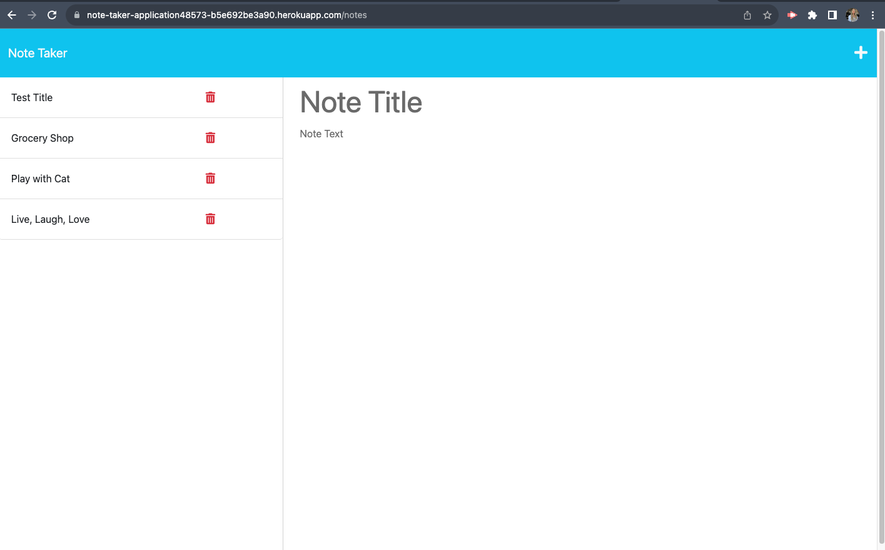

# Note-Taker 🗒️ 🖊️

## Description 
The note-taker application is the perfect tool for small business owners who are balancing a variety of tasks. In fact, this tool is helpful for anyone who needs to organize their thoughts and keep track of tasks they need to complete. 🗂️

## Installation 🖥️
To install the note-taker git clone the repository ont your local environment. To use the note-taker app, follow the deployed link below:
[Note Taker App](https://note-taker-application48573-b5e692be3a90.herokuapp.com/)

## Usage 📸

## Credits 💳
I worked on this project alone. I received source code from the University of Denver coding boot camp to begin this assignment. All files besides app.js and the README were created by the boot camp and their respective developers. 

## License 🪪
This project is not licensed. 

## Features 💾 🗑️
- Create new notes with a title and details.
- Notes are saved on the back-end to reprint after refresh or session ending. 
-Delete a note by clicking the red trash can.

## How to Contribute 🤝🏼
If you would like to contribute to this project, please contact the creator via LinkedIn: [Lillian Edwards](https://www.linkedin.com/in/lillian-edwards63/)

## Tests 🧪
There are no tests available on this application at this time. 

